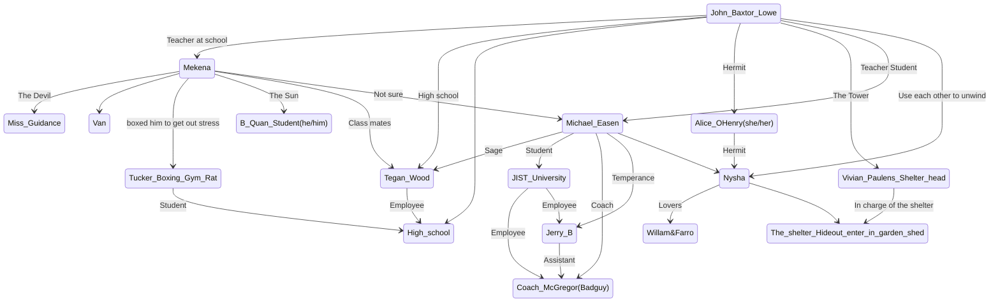

# VoidheartSymphony_relationship
A place to store our VhS relationship diagram

[How to edit Mermaid link](https://mermaid-js.github.io/mermaid/#/examples)

```mermaid
stateDiagram-v2
     Mekena --> Miss_Guidance : The Devil
     Mekena --> Van
     Mekena --> Tucker_Boxing_Gym_Rat : boxed him to get out stress
     Mekena --> B_Quan_Student(he/him) : The Sun
     John_Baxtor_Lowe --> Mekena : Teacher at school
     John_Baxtor_Lowe --> Tegan_Wood : High school
     John_Baxtor_Lowe --> High_school
     Mekena --> Tegan_Wood : Class mates
     Tucker_Boxing_Gym_Rat --> High_school : Student
     Tegan_Wood --> High_school : Employee
     John_Baxtor_Lowe --> Alice_OHenry(she/her) : Hermit
     John_Baxtor_Lowe --> Vivian_Paulens_Shelter_head : The Tower
     Vivian_Paulens_Shelter_head --> The_shelter_Hideout_enter_in_garden_shed : In charge of the shelter
     Alice_OHenry(she/her) --> Nysha : Hermit
     John_Baxtor_Lowe --> Michael_Easen : Teacher Student
     Mekena --> Michael_Easen : Not sure
     Michael_Easen --> Tegan_Wood : Sage
     Michael_Easen --> JIST_University : Student
     Michael_Easen --> Coach_McGregor(Badguy) : Coach
     Michael_Easen --> Jerry_B : Temperance
     JIST_University --> Coach_McGregor(Badguy) : Employee
     Jerry_B --> Coach_McGregor(Badguy) : Assistant
     JIST_University --> Jerry_B : Employee
     Michael_Easen --> Nysha
     Nysha --> Willam&Farro : Lovers
     John_Baxtor_Lowe --> Nysha : Use each other to unwind
     Nysha --> The_shelter_Hideout_enter_in_garden_shed
```
